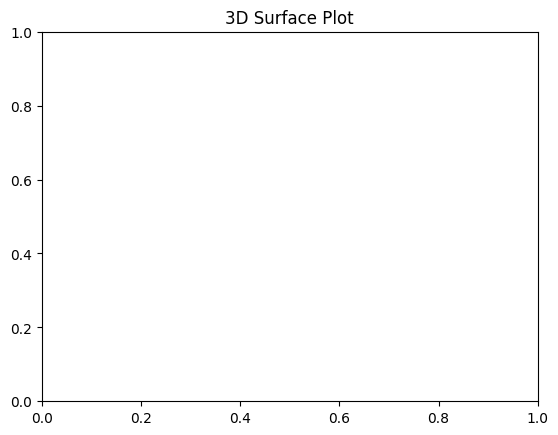

```python
# 3D Plot
```


```python
# import necessary library
```


```python
import matplotlib.pyplot as plt
```


```python
from mpl_toolkits.mplot3d import Axes3D
```


```python
import numpy as np

```


```python
# Data
```


```python
x = np.linspace(-5, 5, 100)
```


```python
y = np.linspace(-5, 5, 100)
```


```python
x, y = np.meshgrid(x, y)
```


```python
z = np.sin(np.sqrt(x**2 + y**2))
```


```python
# Creating a 3D plot
```


```python
fig = plt.figure()
```


    <Figure size 640x480 with 0 Axes>


```python
ax = fig.add_subplot(111, projection='3d')
```


```python
ax.plot_surface(x, y, z, cmap='viridis')
```


    <mpl_toolkits.mplot3d.art3d.Poly3DCollection at 0x10b1314c0>


```python
# Adding title
```


```python
plt.title('3D Surface Plot')

```


    Text(0.5, 1.0, '3D Surface Plot')


    

    


```python
# Show plot
```


```python
plt.show()
```


```python
plt
```


    <module 'matplotlib.pyplot' from '/usr/local/Caskroom/miniconda/base/envs/py312/lib/python3.12/site-packages/matplotlib/pyplot.py'>


```python

```


---
**Score: 20**
