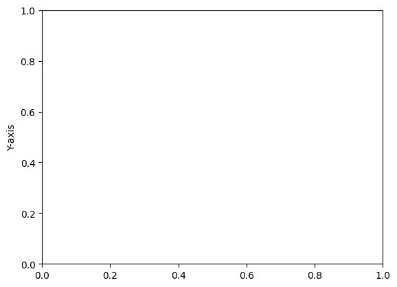

```python
# Area Plot
```


```python
# import necessary library
```


```python
import matplotlib.pyplot as plt
```


```python
import numpy as np

```


```python
# Data
```


```python
x = np.linspace(0, 10, 100)
```


```python
y = np.sin(x)
```


```python
# Creating an area plot
```


```python
plt.fill_between(x, y, color='skyblue', alpha=0.5)
```


    <matplotlib.collections.PolyCollection at 0x116e7bc20>


    

    


```python
# Adding title and labels
```


```python
plt.title('Area Plot')
```


    Text(0.5, 1.0, 'Area Plot')


    

    


```python
plt.xlabel('X-axis')
```


    Text(0.5, 0, 'X-axis')


    

    


```python
plt.ylabel('Y-axis')
```


    Text(0, 0.5, 'Y-axis')


    

    


```python

```


---
**Score: 10**
