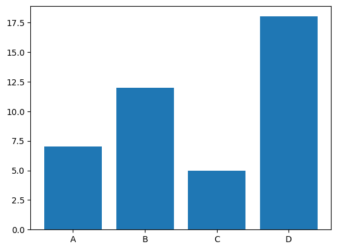
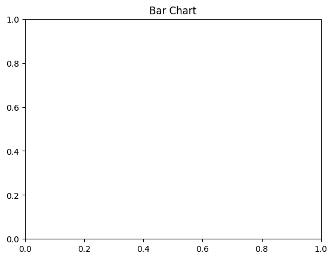
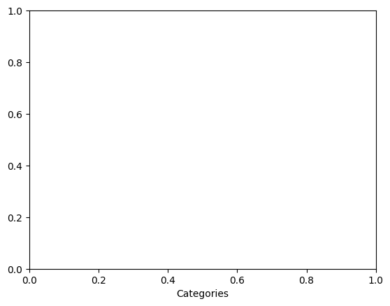
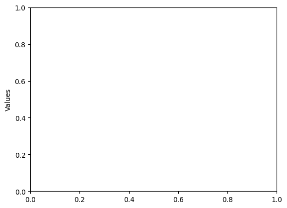

```python
# Bar Chart
```


```python
import matplotlib.pyplot as plt
```


```python
# Data
```


```python
categories = ['A', 'B', 'C', 'D']
```


```python
values = [7, 12, 5, 18]
```


```python
# Creating the bar chart
```


```python
plt.bar(categories, values)
```


    <BarContainer object of 4 artists>


    

    


```python
# Adding title and labels
```


```python
plt.title('Bar Chart')
```


    Text(0.5, 1.0, 'Bar Chart')


    

    


```python
plt.xlabel('Categories')
```


    Text(0.5, 0, 'Categories')


    

    


```python
plt.ylabel('Values')
```


    Text(0, 0.5, 'Values')


    

    


```python

```


```python

```


---
**Score: 10**
