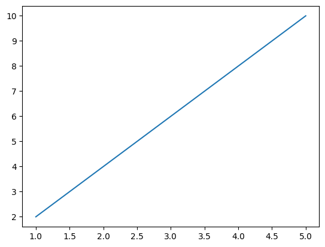
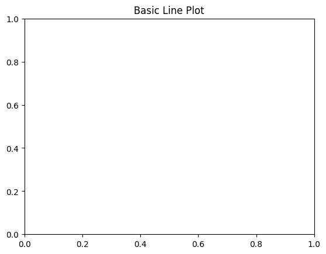
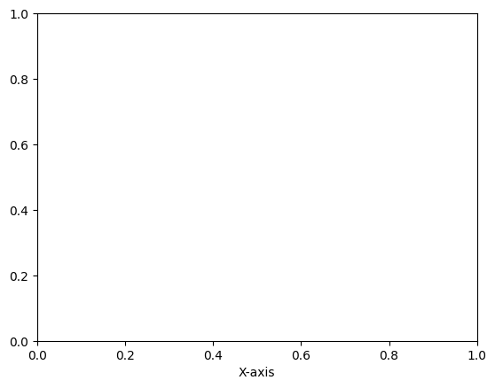
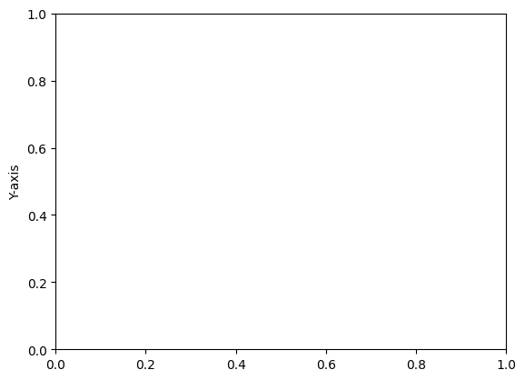

```python
# Basic Line Plot
```


```python
import matplotlib.pyplot as plt
```


```python
# Data
x = [1, 2, 3, 4, 5]
```


```python
# Data
y = [2, 4, 6, 8, 10]
```


```python
# Creating the plot
plt.plot(x, y)
```


    [<matplotlib.lines.Line2D at 0x111965700>]


    

    


```python
# Adding title and labels
plt.title("Basic Line Plot")
```


    Text(0.5, 1.0, 'Basic Line Plot')


    

    


```python
plt.xlabel("X-axis")
```


    Text(0.5, 0, 'X-axis')


    

    


```python
plt.ylabel("Y-axis")
```


    Text(0, 0.5, 'Y-axis')


    

    


```python
# Show plot
plt.show()
```


```python

```


---
**Score: 10**
