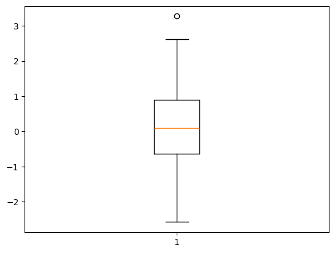
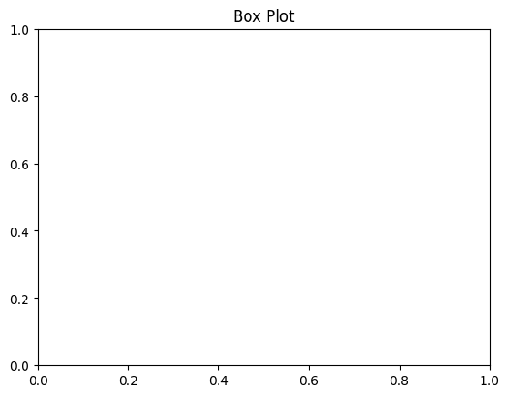
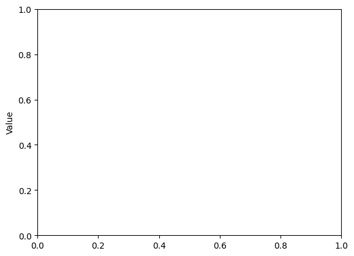

```python
# Box Plot
```


```python
# import necessary library
```


```python
import matplotlib.pyplot as plt
```


```python
import numpy as np
```


```python
# Data
```


```python
data = np.random.normal(0, 1, 100)
```


```python
# Creating a box plot
```


```python
plt.boxplot(data)

```


    {'whiskers': [<matplotlib.lines.Line2D at 0x10b549bb0>,
      <matplotlib.lines.Line2D at 0x10b549e80>],
     'caps': [<matplotlib.lines.Line2D at 0x10b54a150>,
      <matplotlib.lines.Line2D at 0x10b54a450>],
     'boxes': [<matplotlib.lines.Line2D at 0x10b5499a0>],
     'medians': [<matplotlib.lines.Line2D at 0x10b54a720>],
     'fliers': [<matplotlib.lines.Line2D at 0x10b54a9f0>],
     'means': []}


    

    


```python
# Adding title and labels
```


```python
plt.title('Box Plot')
```


    Text(0.5, 1.0, 'Box Plot')


    

    


```python
plt.ylabel('Value')
```


    Text(0, 0.5, 'Value')


    

    


```python

```


---
**Score: 10**
