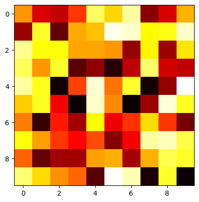
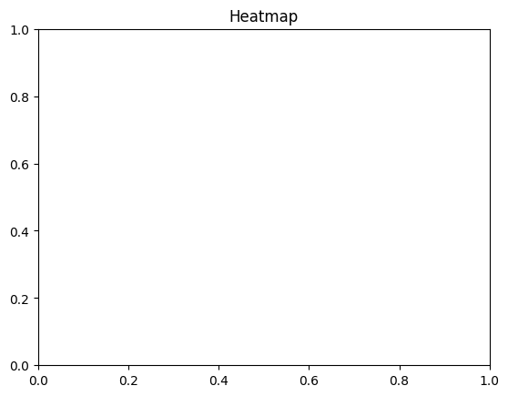

```python
# Heatmap
```


```python
# import necessary library
```


```python
import matplotlib.pyplot as plt
```


```python
import numpy as np
```


```python
# Data
```


```python
data = np.random.rand(10, 10)
```


```python
# Creating a heatmap
```


```python
plt.imshow(data, cmap='hot', interpolation='nearest')
```


    <matplotlib.image.AxesImage at 0x117084770>


    

    


```python
# Adding title
```


```python
plt.title('Heatmap')
```


    Text(0.5, 1.0, 'Heatmap')


    

    


```python
# Show plot
```


```python

plt.show()
```


```python

```


---
**Score: 10**
