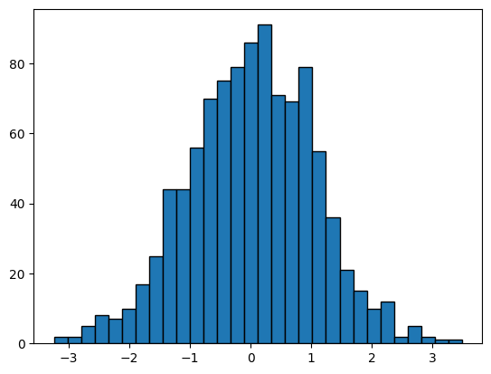
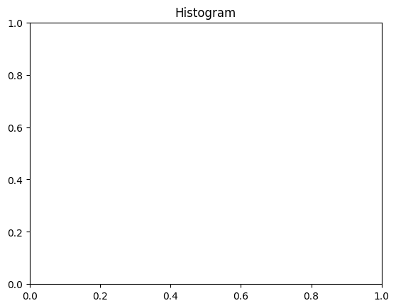
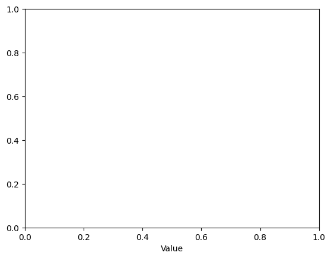
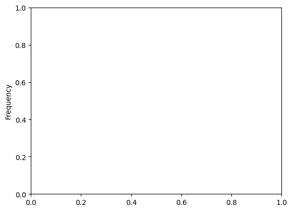

```python
# Histogram
```


```python
# import necessary library
```


```python
import matplotlib.pyplot as plt
```


```python
import numpy as np
```


```python
# Data
```


```python
data = np.random.randn(1000)
```


```python
# Creating the histogram
```


```python
plt.hist(data, bins=30, edgecolor='black')

```


    (array([ 2.,  2.,  5.,  8.,  7., 10., 17., 25., 44., 44., 56., 70., 75.,
            79., 86., 91., 71., 69., 79., 55., 36., 21., 15., 10., 12.,  2.,
             5.,  2.,  1.,  1.]),
     array([-3.23868694, -3.01462395, -2.79056096, -2.56649797, -2.34243498,
            -2.11837199, -1.894309  , -1.670246  , -1.44618301, -1.22212002,
            -0.99805703, -0.77399404, -0.54993105, -0.32586806, -0.10180507,
             0.12225792,  0.34632091,  0.5703839 ,  0.79444689,  1.01850988,
             1.24257287,  1.46663586,  1.69069885,  1.91476185,  2.13882484,
             2.36288783,  2.58695082,  2.81101381,  3.0350768 ,  3.25913979,
             3.48320278]),
     <BarContainer object of 30 artists>)


    

    


```python
# Adding title and labels
```


```python
plt.title('Histogram')
```


    Text(0.5, 1.0, 'Histogram')


    

    


```python
plt.xlabel('Value')
```


    Text(0.5, 0, 'Value')


    

    


```python
plt.ylabel('Frequency')
```


    Text(0, 0.5, 'Frequency')


    

    


```python

```


---
**Score: 10**
