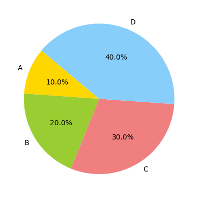
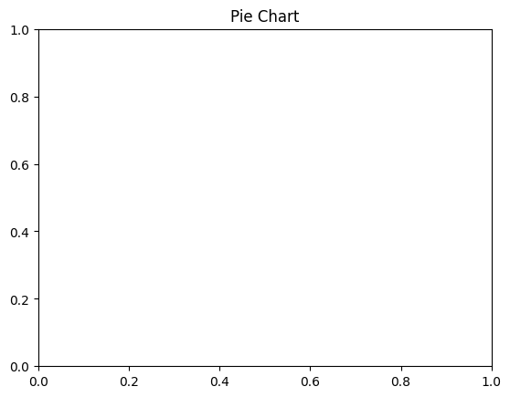

```python
# Pie Chart
```


```python
# import necessary library
```


```python
import matplotlib.pyplot as plt

```


```python
# Data
```


```python
sizes = [10, 20, 30, 40]
```


```python
labels = ['A', 'B', 'C', 'D']
```


```python
colors = ['gold', 'yellowgreen', 'lightcoral', 'lightskyblue']

```


```python
# Creating the pie chart
```


```python
plt.pie(sizes, labels=labels, colors=colors, autopct='%1.1f%%', startangle=140)
```


    ([<matplotlib.patches.Wedge at 0x10cac9700>,
      <matplotlib.patches.Wedge at 0x10ca49df0>,
      <matplotlib.patches.Wedge at 0x10caca3f0>,
      <matplotlib.patches.Wedge at 0x10cacaa50>],
     [Text(-1.0199022419524923, 0.4120672479829963, 'A'),
      Text(-0.932852894856852, -0.5829112081245234, 'B'),
      Text(0.5829112517945186, -0.9328528675688077, 'C'),
      Text(0.41206712862031974, 1.0199022901781352, 'D')],
     [Text(-0.5563103137922685, 0.2247639534452707, '10.0%'),
      Text(-0.508828851740101, -0.3179515680679218, '20.0%'),
      Text(0.3179515918879192, -0.5088288368557132, '30.0%'),
      Text(0.22476388833835623, 0.5563103400971645, '40.0%')])


    

    


```python
# Adding title
```


```python
plt.title('Pie Chart')
```


    Text(0.5, 1.0, 'Pie Chart')


    

    


```python

```


---
**Score: 10**
