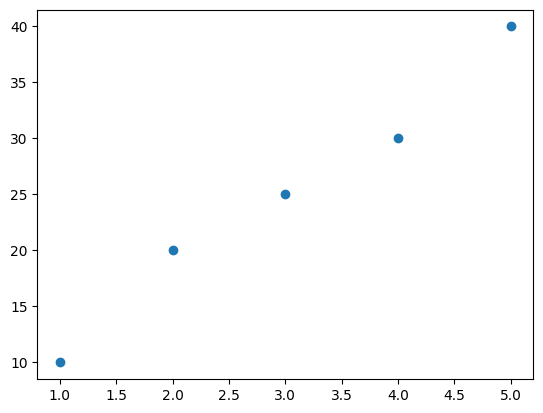
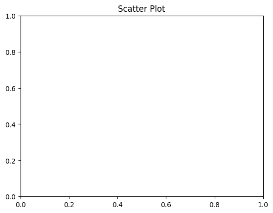
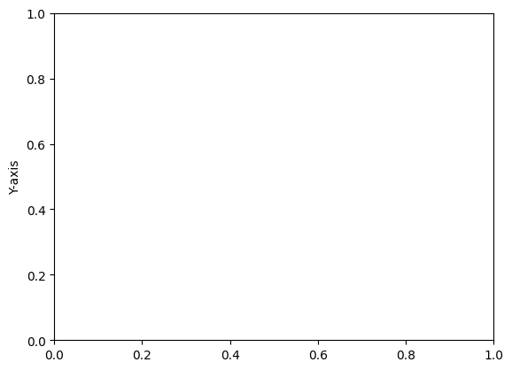

```python
# Scatter Plot
```


```python
import matplotlib.pyplot as plt
```


```python
# Data
x = [1, 2, 3, 4, 5]
```


```python
# Data
y = [10, 20, 25, 30, 40]
```


```python
# Creating the scatter plot
plt.scatter(x, y)
```


    <matplotlib.collections.PathCollection at 0x10db69460>


    

    


```python
# Adding title and labels
```


```python
plt.title('Scatter Plot')
```


    Text(0.5, 1.0, 'Scatter Plot')


    

    


```python
plt.xlabel('X-axis')
```


    Text(0.5, 0, 'X-axis')


    

    


```python
plt.ylabel('Y-axis')
```


    Text(0, 0.5, 'Y-axis')


    

    


```python
plt.show()
```


```python
plt
```


    <module 'matplotlib.pyplot' from '/usr/local/Caskroom/miniconda/base/envs/py312/lib/python3.12/site-packages/matplotlib/pyplot.py'>


```python

```


---
**Score: 10**
