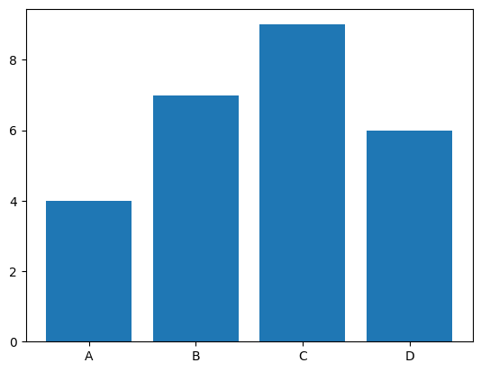
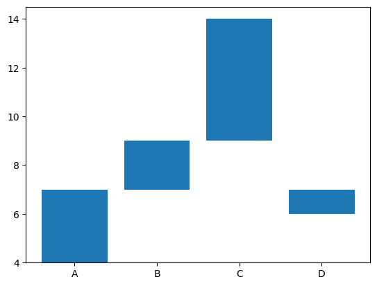
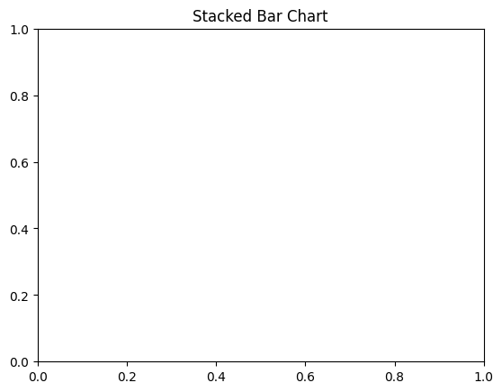
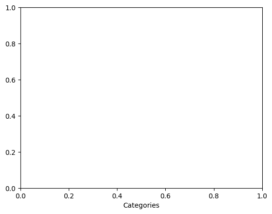
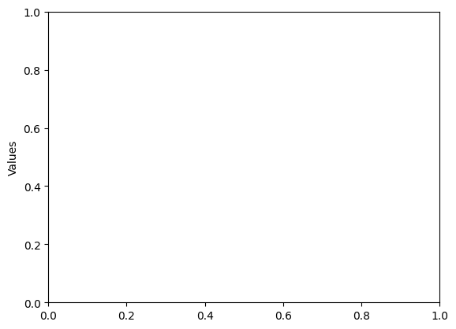
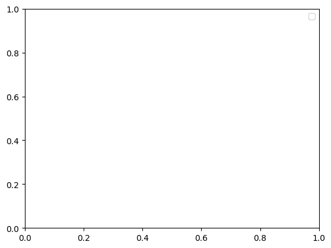

```python
# Stacked Bar Chart
```


```python
# import necessary library
```


```python
import matplotlib.pyplot as plt

```


```python
# Data
```


```python
labels = ['A', 'B', 'C', 'D']
```


```python
category1 = [4, 7, 9, 6]
```


```python
category2 = [3, 2, 5, 1]

```


```python
# Creating a stacked bar chart
```


```python
plt.bar(labels, category1, label='Category 1')
```


    <BarContainer object of 4 artists>


    

    


```python
plt.bar(labels, category2, bottom=category1, label='Category 2')
```


    <BarContainer object of 4 artists>


    

    


```python
# Adding title and labels
```


```python
plt.title('Stacked Bar Chart')
```


    Text(0.5, 1.0, 'Stacked Bar Chart')


    

    


```python
plt.xlabel('Categories')
```


    Text(0.5, 0, 'Categories')


    

    


```python
plt.ylabel('Values')
```


    Text(0, 0.5, 'Values')


    

    


```python
plt.legend()
```

    /var/folders/ss/5vtwrdm14673srh7sngd_6880000gn/T/ipykernel_51940/4061938096.py:1: UserWarning: No artists with labels found to put in legend.  Note that artists whose label start with an underscore are ignored when legend() is called with no argument.
      plt.legend()


    <matplotlib.legend.Legend at 0x116fecf50>


    

    


```python

```


---
**Score: 15**
