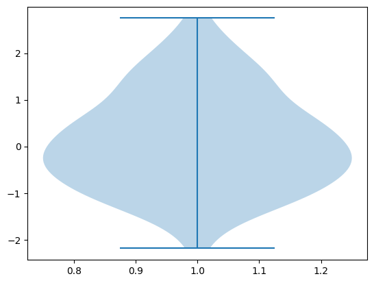
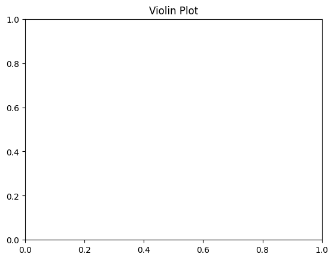

```python
# Violin Plot
```


```python
# import necessary library
```


```python
import matplotlib.pyplot as plt
```


```python
import numpy as np
```


```python
# Data
```


```python
data = np.random.normal(0, 1, 100)
```


```python
data
```


    array([-1.00896769, -1.04937834, -0.79464383, -1.0585053 , -0.37319413,
            0.41837817, -0.49298387,  0.44078265,  1.96077376,  0.78516844,
            0.1461249 , -0.4723821 , -0.21570295, -0.64589961, -0.31228687,
           -0.04080535, -0.20110063,  0.6682114 ,  1.54493594,  0.65610241,
            0.34148652, -0.39771451, -0.71475643, -0.45955653,  0.15542705,
            1.33974947,  1.06586999, -2.18765567,  2.392362  ,  1.47664231,
            0.008509  , -0.11028884, -0.51575358,  1.07841089,  0.29077968,
            1.41431703, -1.03679201,  1.61573929,  0.41619595,  1.65825701,
            1.11710019,  2.75167727, -0.26412822, -0.38754309, -0.69597364,
           -0.35892439,  0.04871884, -1.35922211, -1.16678765, -0.79673334,
            2.00947305,  1.80088867, -1.1143128 , -0.57728433, -1.40951679,
           -0.11685889, -0.36580366,  0.49299873, -0.46293247, -0.87202061,
            0.20872422,  2.27242069, -1.08083772, -0.55437377,  1.48885727,
           -0.87191647,  0.58402508,  0.03547206,  1.40788409, -1.64663219,
            0.78469032, -1.11620438,  1.92595149,  0.05415439, -0.02347257,
           -0.63694636,  0.58241348,  0.78644681, -1.35693193,  1.56227343,
           -0.99411813, -0.05271509,  0.71196667, -0.30863803, -1.75349889,
            1.15969282, -1.30373137,  0.17238442,  0.29695286, -1.18361209,
            0.38804087,  0.63005141,  0.47141191, -1.01288358,  1.07918631,
           -0.04235781, -0.34329526,  1.14920611,  2.23704333,  0.54702937])


```python
# Creating a violin plot
```


```python
plt.violinplot(data)

```


    {'bodies': [<matplotlib.collections.PolyCollection at 0x116523e30>],
     'cmaxes': <matplotlib.collections.LineCollection at 0x1167a6060>,
     'cmins': <matplotlib.collections.LineCollection at 0x1167a6780>,
     'cbars': <matplotlib.collections.LineCollection at 0x1167a6ba0>}


    

    


```python
# Adding title and labels
```


```python
plt.title('Violin Plot')

```


    Text(0.5, 1.0, 'Violin Plot')


    

    


```python

```


---
**Score: 10**
