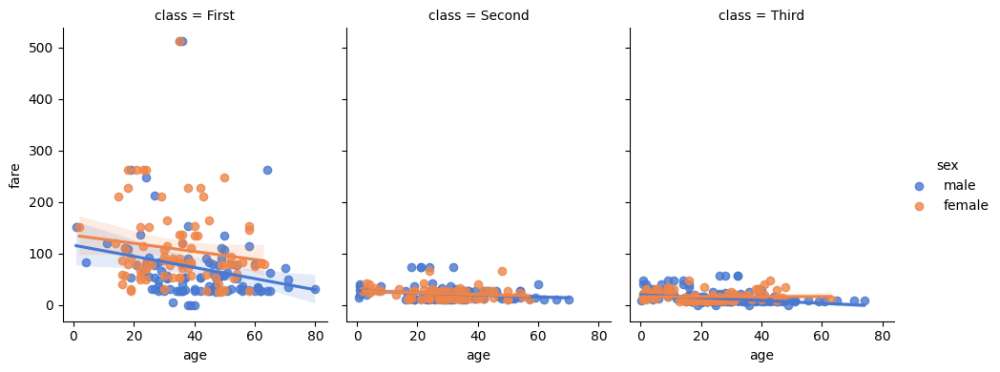

```python
import seaborn as sns

```


```python
import matplotlib.pyplot as plt
```


```python
# Load dataset
```


```python
titanic = sns.load_dataset('titanic')
```


```python
# Create lmplot
```


```python
lmplot = sns.lmplot(data=titanic, x="age", y="fare", hue="sex", col="class", palette="muted", height=4, aspect=0.8)
```


    

    


```python
# Customize plot
```


```python
lmplot.fig.suptitle("LM Plot: Age vs Fare by Class and Sex", fontsize=16, y=1.05)
```


    Text(0.5, 1.05, 'LM Plot: Age vs Fare by Class and Sex')


```python
lmplot.set_axis_labels("Age", "Fare ($)")
```


    <seaborn.axisgrid.FacetGrid at 0x12b7579e0>


```python
plt.tight_layout()
```


    <Figure size 640x480 with 0 Axes>


```python
# Save plot
```


```python
lmplot.savefig("seaborn16_lmplot.png")
```


```python

```


---
**Score: 10**
