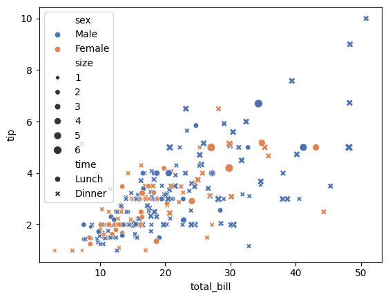
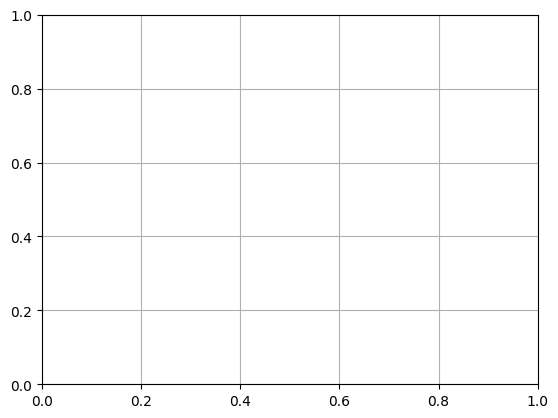

```python
import seaborn as sns
```


```python
!pip install seaborn
```

    Collecting seaborn
      Downloading seaborn-0.13.2-py3-none-any.whl.metadata (5.4 kB)
    Requirement already satisfied: numpy!=1.24.0,>=1.20 in /usr/local/Caskroom/miniconda/base/envs/py312/lib/python3.12/site-packages (from seaborn) (1.26.4)
    Requirement already satisfied: pandas>=1.2 in /usr/local/Caskroom/miniconda/base/envs/py312/lib/python3.12/site-packages (from seaborn) (2.2.3)
    Requirement already satisfied: matplotlib!=3.6.1,>=3.4 in /usr/local/Caskroom/miniconda/base/envs/py312/lib/python3.12/site-packages (from seaborn) (3.9.1)
    Requirement already satisfied: contourpy>=1.0.1 in /usr/local/Caskroom/miniconda/base/envs/py312/lib/python3.12/site-packages (from matplotlib!=3.6.1,>=3.4->seaborn) (1.2.0)
    Requirement already satisfied: cycler>=0.10 in /usr/local/Caskroom/miniconda/base/envs/py312/lib/python3.12/site-packages (from matplotlib!=3.6.1,>=3.4->seaborn) (0.12.1)
    Requirement already satisfied: fonttools>=4.22.0 in /usr/local/Caskroom/miniconda/base/envs/py312/lib/python3.12/site-packages (from matplotlib!=3.6.1,>=3.4->seaborn) (4.53.1)
    Requirement already satisfied: kiwisolver>=1.3.1 in /usr/local/Caskroom/miniconda/base/envs/py312/lib/python3.12/site-packages (from matplotlib!=3.6.1,>=3.4->seaborn) (1.4.5)
    Requirement already satisfied: packaging>=20.0 in /usr/local/Caskroom/miniconda/base/envs/py312/lib/python3.12/site-packages (from matplotlib!=3.6.1,>=3.4->seaborn) (24.1)
    Requirement already satisfied: pillow>=8 in /usr/local/Caskroom/miniconda/base/envs/py312/lib/python3.12/site-packages (from matplotlib!=3.6.1,>=3.4->seaborn) (10.4.0)
    Requirement already satisfied: pyparsing>=2.3.1 in /usr/local/Caskroom/miniconda/base/envs/py312/lib/python3.12/site-packages (from matplotlib!=3.6.1,>=3.4->seaborn) (3.1.2)
    Requirement already satisfied: python-dateutil>=2.7 in /usr/local/Caskroom/miniconda/base/envs/py312/lib/python3.12/site-packages (from matplotlib!=3.6.1,>=3.4->seaborn) (2.9.0.post0)
    Requirement already satisfied: pytz>=2020.1 in /usr/local/Caskroom/miniconda/base/envs/py312/lib/python3.12/site-packages (from pandas>=1.2->seaborn) (2024.2)
    Requirement already satisfied: tzdata>=2022.7 in /usr/local/Caskroom/miniconda/base/envs/py312/lib/python3.12/site-packages (from pandas>=1.2->seaborn) (2024.1)
    Requirement already satisfied: six>=1.5 in /usr/local/Caskroom/miniconda/base/envs/py312/lib/python3.12/site-packages (from python-dateutil>=2.7->matplotlib!=3.6.1,>=3.4->seaborn) (1.16.0)
    Downloading seaborn-0.13.2-py3-none-any.whl (294 kB)
    Installing collected packages: seaborn
    Successfully installed seaborn-0.13.2


```python
import matplotlib.pyplot as plt
```


```python
import pandas as pd
```


```python
# Load dataset
```


```python
tips = sns.load_dataset('tips')
```


```python
# Create scatterplot
```


```python
plt.figure(figsize=(8, 6))
```


    <Figure size 800x600 with 0 Axes>


    <Figure size 800x600 with 0 Axes>


```python
scatter = sns.scatterplot(data=tips, x="total_bill", y="tip", hue="sex", style="time", size="size", palette="deep")
```


    

    


```python
# Customize plot
```


```python
scatter.set_title("Scatterplot of Total Bill vs Tip", fontsize=16)
```


    Text(0.5, 1.0, 'Scatterplot of Total Bill vs Tip')


```python
scatter.set_xlabel("Total Bill ($)", fontsize=12)
```


    Text(0.5, 24.140625, 'Total Bill ($)')


```python
scatter.set_ylabel("Tip ($)", fontsize=12)
```


    Text(24.000000000000007, 0.5, 'Tip ($)')


```python
scatter.legend(title="Legend", fontsize=10, title_fontsize=12, loc="upper left")
```


    <matplotlib.legend.Legend at 0x1305d0b90>


```python
plt.grid(True)

```


    

    


```python
# Save plot
```


```python
plt.savefig("seaborn_scatterplot.png")
```


    <Figure size 640x480 with 0 Axes>


```python
plt.show()
```


```python

```


---
**Score: 15**
