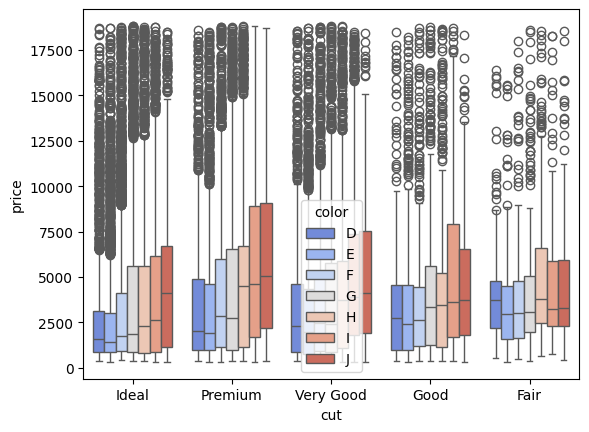
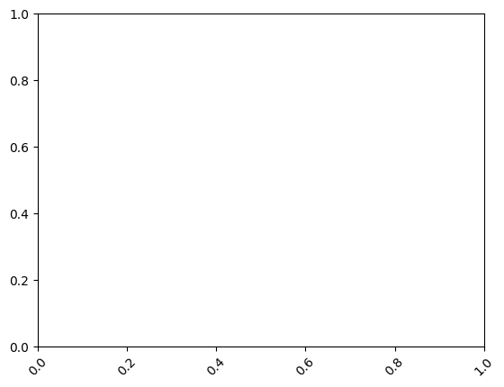
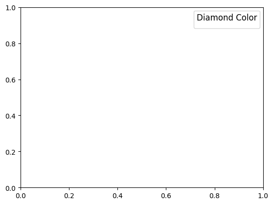

```python
import seaborn as sns
```


```python
import matplotlib.pyplot as plt
```


```python
# Load dataset
```


```python
diamonds = sns.load_dataset('diamonds')
```


```python
# Create boxplot
```


```python
plt.figure(figsize=(10, 6))
```


    <Figure size 1000x600 with 0 Axes>


    <Figure size 1000x600 with 0 Axes>


```python
boxplot = sns.boxplot(data=diamonds, x="cut", y="price", hue="color", palette="coolwarm")
```


    

    


```python
# Customize plot
```


```python
boxplot.set_title("Boxplot of Diamond Prices by Cut and Color", fontsize=16)
```


    Text(0.5, 1.0, 'Boxplot of Diamond Prices by Cut and Color')


```python
boxplot.set_xlabel("Cut", fontsize=12)
```


    Text(0.5, 24.0, 'Cut')


```python
boxplot.set_ylabel("Price ($)", fontsize=12)
```


    Text(24.0, 0.5, 'Price ($)')


```python
plt.xticks(rotation=45)
```


    (array([0. , 0.2, 0.4, 0.6, 0.8, 1. ]),
     [Text(0.0, 0, '0.0'),
      Text(0.2, 0, '0.2'),
      Text(0.4, 0, '0.4'),
      Text(0.6000000000000001, 0, '0.6'),
      Text(0.8, 0, '0.8'),
      Text(1.0, 0, '1.0')])


    

    


```python
plt.legend(title="Diamond Color", fontsize=10, title_fontsize=12, loc="upper right")
```

    /var/folders/ss/5vtwrdm14673srh7sngd_6880000gn/T/ipykernel_44491/778147130.py:1: UserWarning: No artists with labels found to put in legend.  Note that artists whose label start with an underscore are ignored when legend() is called with no argument.
      plt.legend(title="Diamond Color", fontsize=10, title_fontsize=12, loc="upper right")


    <matplotlib.legend.Legend at 0x13190e690>


    

    


```python
plt.tight_layout()
```


    <Figure size 640x480 with 0 Axes>


```python
plt.savefig("seaborn_boxplot.png")
```


    <Figure size 640x480 with 0 Axes>


```python
plt.show()

```


---
**Score: 15**
