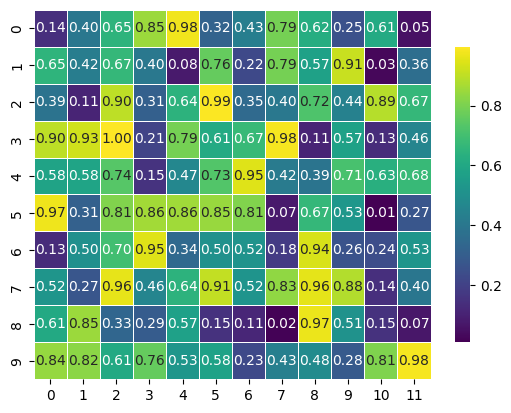

```python
import seaborn as sns
```


```python
import matplotlib.pyplot as plt
```


```python
import numpy as np

```


```python
# Generate random data
```


```python
data = np.random.rand(10, 12)

```


```python
# Create heatmap
```


```python
plt.figure(figsize=(12, 8))
```


    <Figure size 1200x800 with 0 Axes>


    <Figure size 1200x800 with 0 Axes>


```python
heatmap = sns.heatmap(data, annot=True, fmt=".2f", linewidths=0.5, cmap="viridis", cbar_kws={"shrink": 0.8})
```


    

    


```python
# Customize plot
```


```python
heatmap.set_title("Heatmap of Random Data", fontsize=16)
```


    Text(0.5, 1.0, 'Heatmap of Random Data')


```python
heatmap.set_xlabel("X-Axis Label", fontsize=12)
```


    Text(0.5, 4.444444444444445, 'X-Axis Label')


```python
heatmap.set_ylabel("Y-Axis Label", fontsize=12)
```


    Text(4.444444444444452, 0.5, 'Y-Axis Label')


```python
plt.tight_layout()
```


    <Figure size 640x480 with 0 Axes>


```python
# Save plot
```


```python
plt.savefig("seaborn_heatmap.png")
```


    <Figure size 640x480 with 0 Axes>


```python
plt.show()
```


```python

```


---
**Score: 15**
