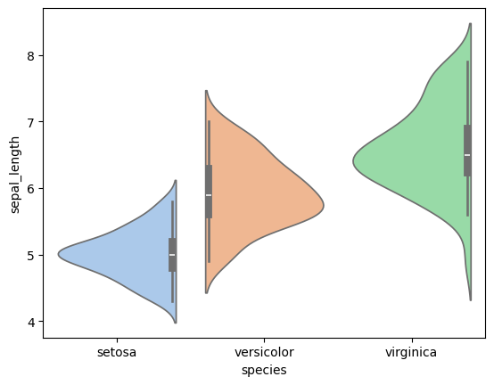
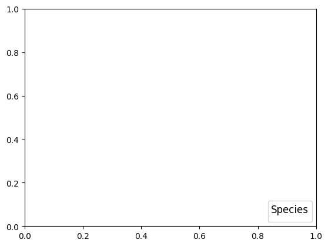

```python
import seaborn as sns
```


```python
import matplotlib.pyplot as plt
```


```python
# Load dataset
```


```python
iris = sns.load_dataset('iris')

```


```python
# Create violin plot
```


```python
plt.figure(figsize=(8, 6))
```


    <Figure size 800x600 with 0 Axes>


    <Figure size 800x600 with 0 Axes>


```python
violin = sns.violinplot(data=iris, x="species", y="sepal_length", hue="species", split=True, palette="pastel")
```


    

    


```python
# Customize plot
```


```python
violin.set_title("Violin Plot of Sepal Length by Species", fontsize=16)

```


    Text(0.5, 1.0, 'Violin Plot of Sepal Length by Species')


```python
violin.set_xlabel("Species", fontsize=12)
```


    Text(0.5, 24.0, 'Species')


```python
violin.set_ylabel("Sepal Length (cm)", fontsize=12)
```


    Text(24.140625000000007, 0.5, 'Sepal Length (cm)')


```python
plt.legend(title="Species", fontsize=10, title_fontsize=12, loc="lower right")
```

    /var/folders/ss/5vtwrdm14673srh7sngd_6880000gn/T/ipykernel_46623/901306951.py:1: UserWarning: No artists with labels found to put in legend.  Note that artists whose label start with an underscore are ignored when legend() is called with no argument.
      plt.legend(title="Species", fontsize=10, title_fontsize=12, loc="lower right")


    <matplotlib.legend.Legend at 0x12958b590>


    

    


```python
plt.tight_layout()
```


    <Figure size 640x480 with 0 Axes>


```python
# Save plot
```


```python
plt.savefig("s_violinplot.png")
```


    <Figure size 640x480 with 0 Axes>


```python
plt.show()

```


```python

```


---
**Score: 15**
