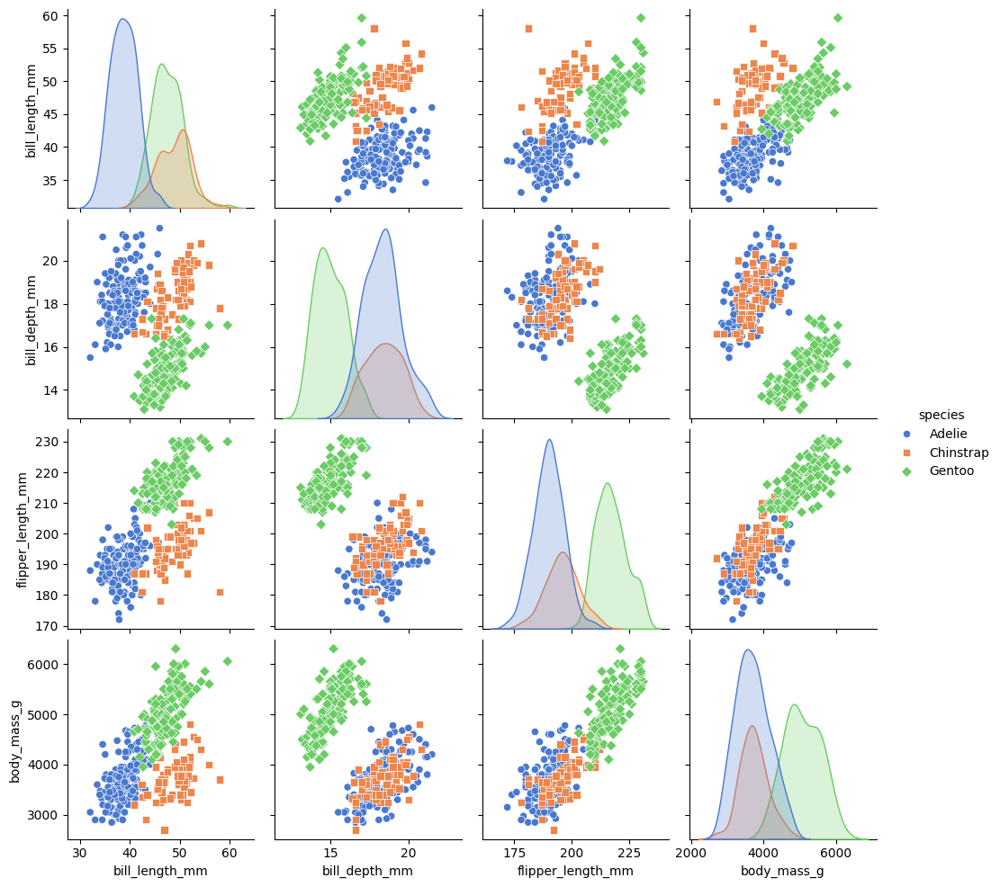

```python

```


```python
import matplotlib.pyplot as plt
```


```python
import seaborn as sns
```


```python
# Load dataset
```


```python
penguins = sns.load_dataset('penguins')
```


```python
# Create pairplot
```


```python
pairplot = sns.pairplot(data=penguins, hue="species", palette="muted", diag_kind="kde", markers=["o", "s", "D"])
```


    

    


```python
# Customize plot
```


```python
pairplot.fig.suptitle("Pairplot of Penguin Dataset", fontsize=16)
```


    Text(0.5, 0.98, 'Pairplot of Penguin Dataset')


```python
pairplot.fig.tight_layout()
```


```python
# Save plot
```


```python
pairplot.savefig("seaborn10_pairplot.png")
```


```python
plt.show()
```


```python

```


---
**Score: 10**
