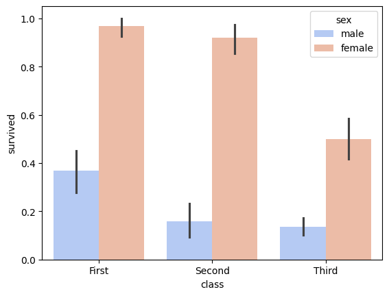
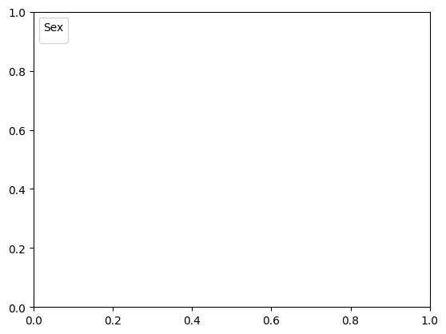
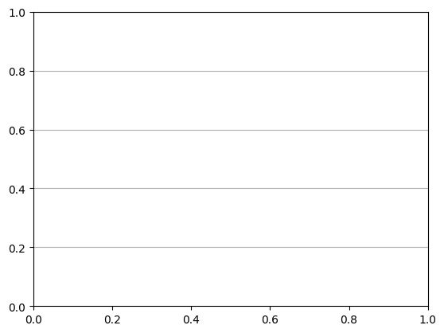

```python


```


```python
import seaborn as sns
```


```python
import matplotlib.pyplot as plt
```


```python
# Load dataset
```


```python
titanic = sns.load_dataset('titanic')
```


```python
# Create barplot
```


```python
plt.figure(figsize=(8, 6))
```


    <Figure size 800x600 with 0 Axes>


    <Figure size 800x600 with 0 Axes>


```python
barplot = sns.barplot(data=titanic, x="class", y="survived", hue="sex", palette="coolwarm")
```


    

    


```python
# Customize plot
```


```python
barplot.set_title("Survival Rate by Class and Sex", fontsize=16)
```


    Text(0.5, 1.0, 'Survival Rate by Class and Sex')


```python
barplot.set_xlabel("Class", fontsize=12)
```


    Text(0.5, 24.0, 'Class')


```python
barplot.set_ylabel("Survival Rate", fontsize=12)
```


    Text(24.000000000000007, 0.5, 'Survival Rate')


```python
plt.legend(title="Sex", loc="upper left")
```

    /var/folders/ss/5vtwrdm14673srh7sngd_6880000gn/T/ipykernel_47962/1968091866.py:1: UserWarning: No artists with labels found to put in legend.  Note that artists whose label start with an underscore are ignored when legend() is called with no argument.
      plt.legend(title="Sex", loc="upper left")


    <matplotlib.legend.Legend at 0x12880eea0>


    

    


```python
plt.grid(axis='y')
```


    

    


```python
# Save plot
```


```python
plt.savefig("seaborn11_barplot.png")
```


    <Figure size 640x480 with 0 Axes>


```python
plt.show()
```


```python

```


---
**Score: 15**
