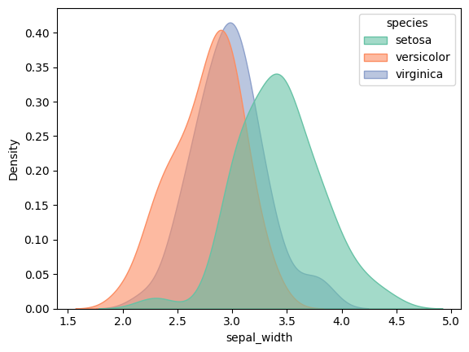
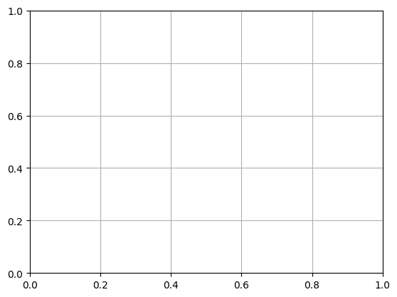

```python
import seaborn as sns
```


```python
import matplotlib.pyplot as plt
```


```python
# Load dataset
```


```python
iris = sns.load_dataset('iris')
```


```python
# Create KDE plot
```


```python
plt.figure(figsize=(8, 6))
```


    <Figure size 800x600 with 0 Axes>


    <Figure size 800x600 with 0 Axes>


```python
kdeplot = sns.kdeplot(data=iris, x="sepal_width", hue="species", fill=True, palette="Set2", alpha=0.6)

```


    

    


```python
# Customize plot
```


```python
kdeplot.set_title("KDE Plot of Sepal Width by Species", fontsize=16)
```


    Text(0.5, 1.0, 'KDE Plot of Sepal Width by Species')


```python
kdeplot.set_xlabel("Sepal Width (cm)", fontsize=12)
```


    Text(0.5, 24.140625, 'Sepal Width (cm)')


```python
kdeplot.set_ylabel("Density", fontsize=12)
```


    Text(24.000000000000007, 0.5, 'Density')


```python
plt.grid(True)
```


    

    


```python
# Save plot
```


```python
plt.savefig("seaborn_kdeplot.png")
```


    <Figure size 640x480 with 0 Axes>


```python
plt.show()
```


```python

```


---
**Score: 15**
