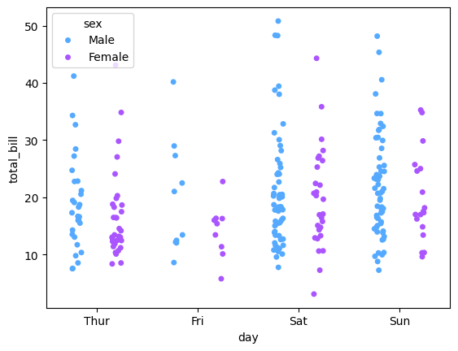
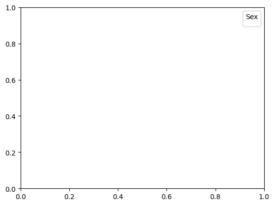
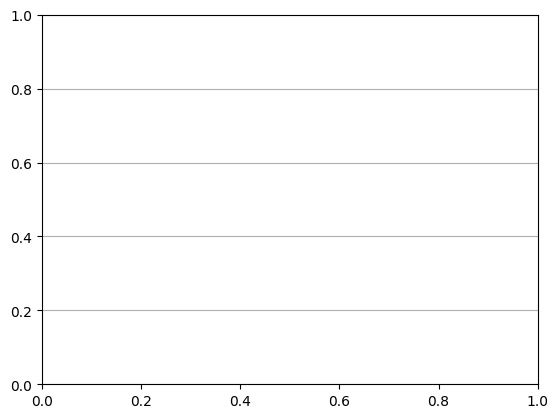

```python
import seaborn as sns
```


```python
import matplotlib.pyplot as plt
```


```python
# Load dataset
```


```python
tips = sns.load_dataset('tips')
```


```python

# Create stripplot
```


```python
plt.figure(figsize=(8, 6))
```


    <Figure size 800x600 with 0 Axes>


    <Figure size 800x600 with 0 Axes>


```python
stripplot = sns.stripplot(data=tips, x="day", y="total_bill", hue="sex", dodge=True, jitter=True, palette="cool")
```


    

    


```python
# Customize plot
```


```python
stripplot.set_title("Stripplot of Total Bill by Day and Sex", fontsize=16)
```


    Text(0.5, 1.0, 'Stripplot of Total Bill by Day and Sex')


```python
stripplot.set_xlabel("Day", fontsize=12)
```


    Text(0.5, 24.0, 'Day')


```python
stripplot.set_ylabel("Total Bill ($)", fontsize=12)
```


    Text(24.140625000000007, 0.5, 'Total Bill ($)')


```python
plt.legend(title="Sex", loc="upper right")
```

    /var/folders/ss/5vtwrdm14673srh7sngd_6880000gn/T/ipykernel_49643/517473379.py:1: UserWarning: No artists with labels found to put in legend.  Note that artists whose label start with an underscore are ignored when legend() is called with no argument.
      plt.legend(title="Sex", loc="upper right")


    <matplotlib.legend.Legend at 0x12c8a6180>


    

    


```python
plt.grid(axis='y')
```


    

    


```python
# Save plot
```


```python
plt.savefig("seaborn14_stripplot.png")
```


    <Figure size 640x480 with 0 Axes>


```python
plt.show()
```


```python

```


---
**Score: 15**
