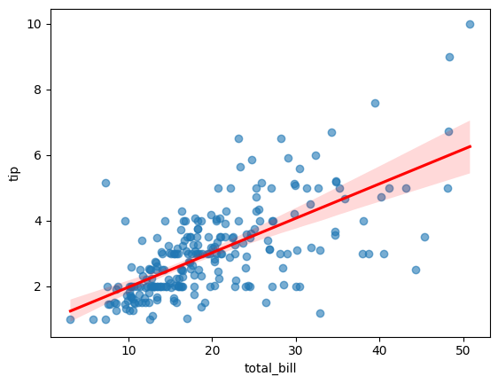

```python
import seaborn as sns
```


```python
import matplotlib.pyplot as plt
```


```python
# Load dataset
```


```python
tips = sns.load_dataset('tips')

```


```python
# Create regression plot
```


```python
plt.figure(figsize=(8, 6))
```


    <Figure size 800x600 with 0 Axes>


    <Figure size 800x600 with 0 Axes>


```python
regplot = sns.regplot(data=tips, x="total_bill", y="tip", scatter_kws={'alpha':0.6}, line_kws={'color':'red'})

```


    

    


```python
# Customize plot
```


```python
regplot.set_title("Regression Plot of Total Bill vs Tip", fontsize=16)
```


    Text(0.5, 1.0, 'Regression Plot of Total Bill vs Tip')


```python
regplot.set_xlabel("Total Bill ($)", fontsize=12)
```


    Text(0.5, 24.140625, 'Total Bill ($)')


```python
regplot.set_xlabel("Total Bill ($)", fontsize=12)
```


    Text(0.5, 24.140625, 'Total Bill ($)')


```python
plt.grid(True)
```


    

    


```python
# Save plot
```


```python
plt.savefig("seaborn15_regplot.png")
```


    <Figure size 640x480 with 0 Axes>


```python
plt.show()
```


```python

```


---
**Score: 15**
